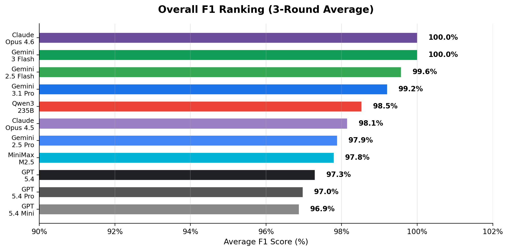
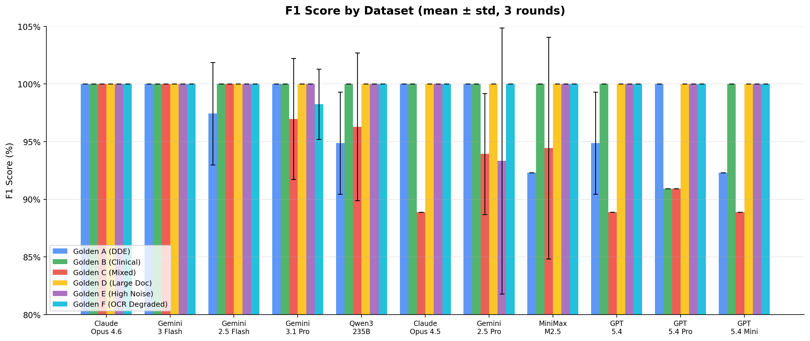
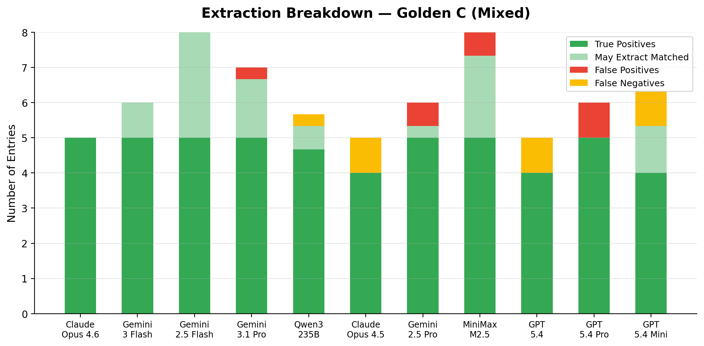
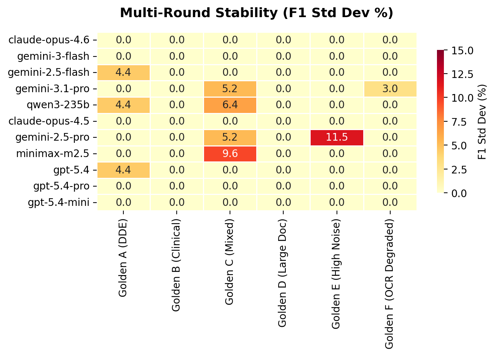
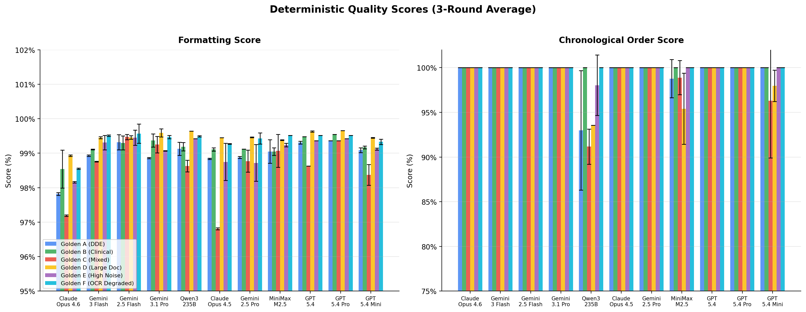
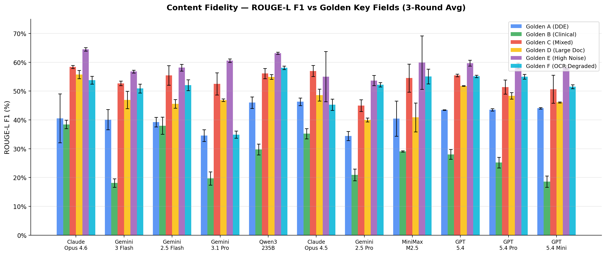
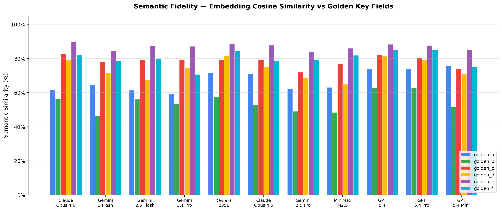
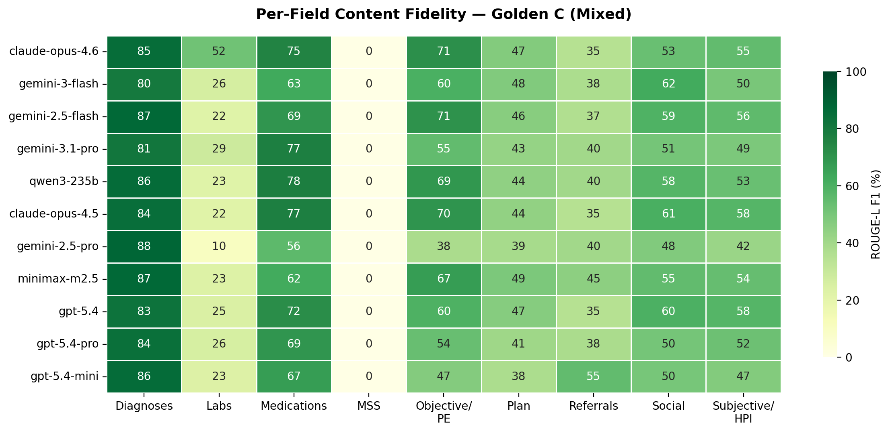
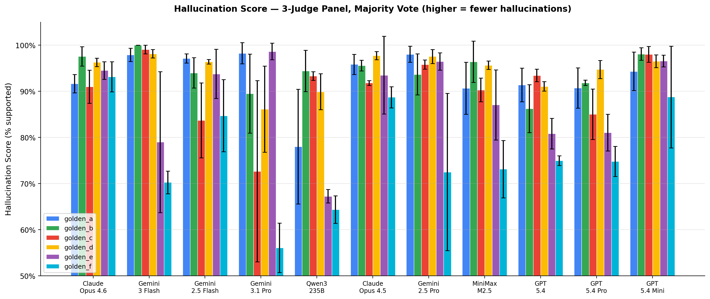
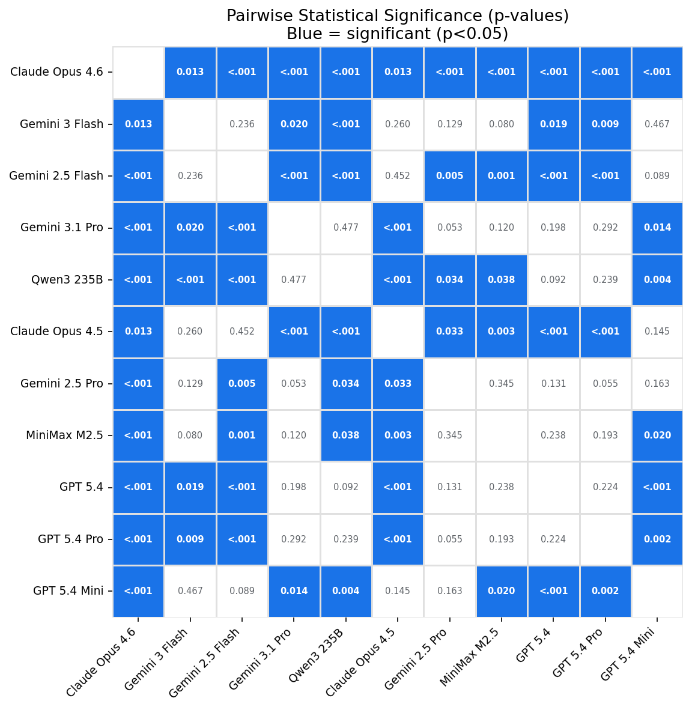

# Medical Chronology Benchmark

**LLM Model Comparison for Med-Legal Extraction**

6 Golden Datasets × 11 Models × 3 Rounds × 6 Evaluation Dimensions

<span class="footnote">For methodology details see <a href="METHODOLOGY.md">METHODOLOGY.md</a> · † FP16 (Nebius dedicated) · ‡ FP4 (Nebius serverless) · unmarked = official API</span>

---

## Why This Matters

In medical-legal cases, **Medical Chronology** is the foundation of case review. Producing one manually from hundreds of pages of records takes **8–20 hours per case**.

We need to know: **which LLM can most reliably extract structured timelines from unstructured medical records — without hallucinating?**

Six evaluation dimensions:
- **Extraction Accuracy** — Precision / Recall / F1 against golden ground truth
- **Content Fidelity** — ROUGE-L similarity of extracted fields vs golden key_fields
- **Semantic Fidelity** — Embedding-based similarity (captures paraphrasing)
- **Formatting** — Markdown structure, heading hierarchy, field labels
- **Chronological Order** — Dates appear in correct ascending sequence
- **Hallucination** — LLM-judge verified claim accuracy against source

---

<!-- _class: dense -->

## Experiment Design

| Dimension | Detail |
|-----------|--------|
| **Task** | One-shot Medical Chronology extraction from synthetic medical records |
| **Golden Datasets** | 6 datasets with known ground truth (see next slides) |
| **Models (11)** | Gemini 2.5 Pro/Flash, 3 Flash, 3.1 Pro; Qwen3-235B†; GPT-5.4/Pro/Mini; Claude Opus 4.6/4.5; MiniMax M2.5‡ |
| **Serving** | 9 models via official API; Qwen3-235B† via Nebius dedicated (FP16); MiniMax M2.5‡ via Nebius serverless (**FP4**) |
| **Rounds** | 3 independent generation rounds per model per dataset |
| **Evaluation** | Extraction P/R/F1 + Content Fidelity (ROUGE-L & Semantic) + Formatting + Chronological + Hallucination |
| **Matching** | Hungarian algorithm (optimal bipartite) with fuzzy facility matching |
| **Statistics** | Paired bootstrap significance test (10K iterations, p<0.05) |

> Ground truth built via **multi-model consensus** (golden_a–c) and **synthetic design** (golden_d–f)

---

## Why Golden Dataset?

**Core idea: build the answer first, then generate the exam.**

```
Known Answers (golden entries)  →  LLM generates realistic source doc
                                         ↓
                                   Models extract from source
                                         ↓
                                   Compare to known answers → P/R/F1
```

> Manual annotation is infeasible at scale. This automates ground truth creation.

---

## How Golden Entries Are Built

**Consensus method (golden_a–c):**
```
Real Documents ──→ Run 5-6 models ──→ Collect all extracted entries
                                              ↓
                              Multi-model consensus (≥2 agree)
                                              ↓
                                     Golden Entries (ground truth)
```

**Synthetic design method (golden_d–f):**
```
Manually designed golden entries ──→ LLM generates realistic source doc
                                              ↓
                                     Validation: verify all entries
                                     are recoverable from source
```

---

## How Synthetic Sources Are Built

Golden entries are fed to an LLM that generates a realistic medical record:

- **Paraphrasing** — all clinical content rewritten in different words; tests comprehension, not copy-paste
- **Noise injection** — administrative dates (billing, scheduling, insurance) embedded without labels; tests filtering ability
- **Split information** — some encounters' data scattered across sections; tests synthesis ability
- **OCR artifacts** — typos, inconsistent date formats, page headers; mimics real-world messiness

---

<!-- _class: dense -->

## Golden Datasets Overview

| Dataset | Style | Must | May | Noise | Tokens | Design Intent |
|---------|-------|:---:|:---:|:---:|:---:|:---:|
| **golden_a** | DDE | 7 | 2 | 6 | 4.4K | Baseline — short, clean DDE |
| **golden_b** | Clinical Note | 10 | 1 | 8 | 11.1K | Paraphrasing stress test |
| **golden_c** | Mixed | 5 | 3 | 15 | 7.6K | Noise filtering (highest noise ratio) |
| **golden_d** | DDE | 15 | 0 | 13 | 7.2K | Volume stress (15 entries) ⚠️ |
| **golden_e** | Mixed | 8 | 0 | 5 | 7.0K | Balanced difficulty |
| **golden_f** | Mixed | 10 | 0 | 9 | 14.4K | OCR degradation + long document |

- **must_extract** — true clinical encounters; missing = false negative
- **may_extract** — borderline (telephone, orders-only); no penalty either way
- **noise** — non-clinical dates; extracting = false inclusion

> ⚠️ **golden_d** achieves 100% F1 for all models — effective for hallucination testing but provides no F1 differentiation. Each dataset targets a different stress dimension; size variation is by design.

---

<!-- _class: compact -->

## Dataset Snapshots — What Each Source Looks Like

| Dataset | Source Header | Key Feature |
|---------|-------------|-------------|
| **golden_a** | `CLAIMANT: Harrison, John P. / CLAIM #: 388-00-9123` | Clean DDE sections |
| **golden_b** | `SUBJECTIVE: The patient, a 39-year-old female...` | Long SOAP narratives |
| **golden_c** | `0BJECTIVE:` / `clozapine rnedication` | OCR errors (`0`→`O`, `rn`→`m`) |
| **golden_d** | `SSN: XXX-XX-6789 / SECTION B: EVIDENCE LIST` | 15 entries across 5 specialties |
| **golden_e** | `DOB: XX/XX/XXXX / Summit Neurology Associates` | Balanced mixed format |
| **golden_f** | `FAX COVER SHEET / INSURANCE AUTHORIZATION` | Admin noise + OCR + 251K chars |

> OCR artifacts are intentional — they test whether models fabricate content when source text is corrupted (e.g., `rnedication` → models may "correct" to `medication` and hallucinate dosage details).

---

## Evaluation Metrics

| Dimension | Metric | What It Measures |
|-----------|--------|-----------------|
| **Extraction** | Precision / Recall / F1 | Entry-level: did the model find the right encounters? |
| **Content Fidelity** | ROUGE-L F1 | Field-level: does extracted text match golden key_fields? |
| **Semantic Fidelity** | Cosine similarity (embeddings) | Field-level: semantic equivalence beyond surface text |
| **Formatting** | Deterministic score | Structure: headings, field labels, date format |
| **Chronological** | Deterministic score | Are dates in ascending order? |
| **Hallucination** | Multi-judge LLM score | Are extracted claims supported by source? |

---

<!-- _class: compact -->

## Evaluation in Action — One Entry, Six Dimensions

**Example:** golden_a, `2023-02-08` — Right Total Hip Arthroplasty at Central Plains Medical Center

| Dimension | What's Compared | Result |
|-----------|----------------|--------|
| **F1** | Date + Facility match between golden and model output | ✅ TP (exact match) |
| **ROUGE-L** | Golden: `"RT total hip arthroplasty (robotic assisted)"` vs Model: `"Robotic-assisted right total hip arthroplasty"` | **~60%** (word order differs) |
| **Semantic** | Same text pair as above, compared via embeddings | **~95%** (meaning identical) |
| **Formatting** | `## Date of Medical Visit: 02/08/2023` + `* **Diagnoses:**` | ✅ correct structure |
| **Chrono** | `01/26/2023` → `02/08/2023` → `04/13/2023` | ✅ ascending order |
| **Halluc** | `"robotic assisted"` → verified against source text | ✅ supported |

> ROUGE-L penalizes valid paraphrasing (60%), while Semantic Fidelity captures true equivalence (95%). This is why multi-dimensional evaluation matters.

---

## Overall F1 Ranking



> 3-round average. Two models achieve **100% F1**: claude-opus-4.6 and gemini-3-flash. All 11 models score **>96%**.

---

## F1 Score by Dataset



> **golden_d = 100% for all models** (no differentiation). Variance concentrates on **golden_c** and **golden_e** (spread up to 20%).

---

<!-- _class: dense -->

## Where Models Differ — Golden C (Mixed)

| Model | P | R | F1 | FP | FN | May |
|-------|:-:|:-:|:--:|:--:|:--:|:---:|
| claude-opus-4.6 | 100% | 100% | 100% | 0 | 0 | 0 |
| gemini-3-flash | 100% | 100% | 100% | 0 | 0 | 1 |
| qwen3-235b† | 100% | 100% | 100% | 0 | 0 | 1 |
| gemini-2.5-flash | 100% | 100% | 100% | 0 | 0 | 3 |
| gemini-2.5-pro | 83% | 100% | 91% | 1 | 0 | 0 |
| gemini-3.1-pro | 83% | 100% | 91% | 1 | 0 | 3 |
| gpt-5.4-pro | 83% | 100% | 91% | 1 | 0 | 0 |
| claude-opus-4.5 | 100% | 80% | 89% | 0 | 1 | 0 |
| gpt-5.4 | 100% | 80% | 89% | 0 | 1 | 0 |
| gpt-5.4-mini | 100% | 80% | 89% | 0 | 1 | 1 |
| minimax-m2.5‡ | 71% | 100% | 83% | 2 | 0 | 2 |

> Hardest dataset: 15 noise dates, 3 may_extract borderline cases. Models split between **conservative** (high P, low R) and **aggressive** (high R, low P).

---

## Extraction Breakdown — Golden C (Mixed)



> gemini-2.5-flash extracts the most `may_extract` entries (3). minimax-m2.5‡ has the most FP (2) — FP4 quantization may contribute to over-extraction.

---

## Multi-Round Stability (3 Rounds)



> 3-round evaluation complete. claude-opus-4.6 and gemini-3-flash show **zero variance** (100% F1 every round). Most models have std < 5%.

---

## Formatting & Chronological Order



> All models achieve **>98% formatting**. Chronological order is near-perfect for most; **qwen3-235b†** has occasional ordering issues (96.7% avg), **gpt-5.4-mini** (97.6%), and **minimax-m2.5‡** (99.4%).

---

## Content Fidelity — ROUGE-L F1



> Avg range: **40.6%** (gemini-2.5-pro) to **51.2%** (qwen3-235b†). golden_e highest (~59–65%); golden_b lowest (~18–40%) due to heavy paraphrasing.

---

## Semantic Fidelity — Embedding Similarity



> **gpt-5.4** leads at **78.9%**, followed by **gpt-5.4-pro** (78.1%) and **qwen3-235b†** (77.2%). Better differentiator than ROUGE-L for paraphrased content.

---

## Per-Field Content Fidelity — Golden C



> **Diagnoses** scores highest across all models (>80%) — short, structured text is easiest to match. **MSS** scores 0% (golden_c has no MSS fields). **Lab Results** shows the most model variation (3–53%).

---

## Hallucination Score (All 6 Datasets)



> Multi-judge LLM evaluation (Gemini + GPT + Claude majority vote, 3 rounds). Top: **gpt-5.4-mini** (95.4%), **claude-opus-4.6** (94.0%). Worst: **qwen3-235b†** (81.2%). **golden_f (OCR)** is the hardest — 2 models below 70%.

---

<!-- _class: dense -->

## Hallucination Breakdown (All 6 Datasets)

| Model | A | B | C | D | E | F | AVG |
|-------|:-:|:-:|:-:|:-:|:-:|:-:|:---:|
| gpt-5.4-mini | 94.3% | 98.1% | 98.0% | 96.5% | 96.6% | 88.8% | **95.4%** |
| claude-opus-4.6 | 91.7% | 97.6% | 91.0% | 96.3% | 94.5% | 93.2% | **94.0%** |
| claude-opus-4.5 | 95.9% | 95.6% | 91.8% | 97.8% | 93.5% | 88.7% | **93.9%** |
| gemini-2.5-pro | 98.0% | 93.7% | 95.8% | 97.6% | 96.5% | 72.5% | **92.4%** |
| gemini-2.5-flash | 97.1% | 94.0% | 83.7% | 96.4% | 93.8% | 84.7% | **91.6%** |
| gemini-3-flash | 97.9% | 100.0% | 99.1% | 98.2% | 79.0% | 70.3% | **90.7%** |
| minimax-m2.5‡ | 90.7% | 96.4% | 90.3% | 95.7% | 87.1% | 73.1% | **88.9%** |
| gpt-5.4-pro | 90.7% | 91.8% | 85.0% | 94.8% | 81.1% | 74.8% | **86.4%** |
| gpt-5.4 | 91.4% | 86.2% | 93.5% | 91.1% | 80.8% | 75.0% | **86.3%** |
| gemini-3.1-pro | 98.3% | 89.5% | 72.7% | 86.1% | 98.7% | 56.1% | **83.6%** |
| qwen3-235b† | 78.0% | 94.4% | 93.3% | 89.9% | 67.3% | 64.4% | **81.2%** |

> 3-round average, multi-judge majority vote. **golden_f (OCR degraded)** is the hardest — 2 models below 70%. Inter-judge agreement: **88.6%** (reliable).

---

<!-- _class: compact -->

## Comprehensive Model Summary (3-Round Average)

| Model | F1 | Fmt | Chrono | ROUGE-L | Semantic | Halluc | Composite |
|-------|:--:|:---:|:------:|:-------:|:--------:|:------:|:---------:|
| **claude-opus-4.6** | 100.0% | 98.2% | 100% | 51.9% | 75.4% | 94.0% | **0.889** |
| **claude-opus-4.5** | 98.2% | 98.7% | 100% | 47.9% | 74.2% | 93.9% | 0.877 |
| **gemini-2.5-flash** | 99.6% | 99.4% | 100% | 48.1% | 71.9% | 91.6% | 0.873 |
| gpt-5.4 | 97.3% | 99.3% | 100% | 48.9% | **78.9%** | 86.3% | 0.871 |
| gpt-5.4-mini | 96.9% | 99.1% | 99.1% | 44.9% | 72.1% | **95.4%** | 0.869 |
| gpt-5.4-pro | 97.0% | 99.5% | 100% | 47.0% | 78.1% | 86.4% | 0.866 |
| gemini-3-flash | 100.0% | 99.2% | 100% | 44.3% | 70.7% | 90.7% | 0.866 |
| qwen3-235b† | 98.5% | 99.2% | 96.0% | 51.4% | 77.2% | 81.2% | 0.859 |
| gemini-2.5-pro | 97.9% | 99.1% | 100% | 41.0% | 69.2% | 92.4% | 0.857 |
| minimax-m2.5‡ | 97.8% | 99.2% | 98.8% | 46.7% | 70.2% | 88.9% | 0.856 |
| gemini-3.1-pro | 99.2% | 99.3% | 100% | 41.5% | 70.7% | 83.6% | 0.847 |

> All metrics averaged across 6 golden datasets × 3 rounds. Composite = F1 30% + Semantic 20% + Halluc 20% + Format 10% + Chrono 10% + ROUGE 10%.
> † FP16 (Nebius dedicated) · ‡ **FP4** (Nebius serverless) · unmarked = official API


---

<!-- _class: compact -->

## Why Statistical Significance?

**Problem:** Model A averages 0.889 composite, Model B averages 0.857. Is A truly better, or is the gap just luck?

LLMs produce different outputs each run. Without a statistical test, we can't distinguish **real ability gaps** from **random noise**.

**Our approach — Paired Bootstrap Test on Composite Score:**

| Step | What Happens |
|------|-------------|
| **1. Composite** | Per (round, dataset): F1×30% + Semantic×20% + Halluc×20% + Fmt×10% + Chrono×10% + ROUGE×10% |
| **2. Pair up** | Same `(round, dataset)` → both models get a composite → compute difference |
| **3. Sample size** | 3 rounds × 6 datasets = **18 paired observations** per model pair |
| **4. Resample** | Randomly draw 18 differences (with replacement) → compute mean → repeat **10,000×** |
| **5. p-value** | Fraction of resamples where the gap flips direction (≤0). If <5%, the gap is "real" |

> **Why composite, not just F1?** F1 alone is near-ceiling (96.9–100%) with little differentiation. Composite captures all six evaluation dimensions, giving the bootstrap test more signal to work with.

---

<!-- _class: compact -->

## Pairwise Significance — Concrete Examples

**How to read:** mean_diff = composite gap; p-value < 0.05 = significant; 95% CI = plausible range of true gap.

| Pair (A vs B) | Δ Composite | p-value | 95% CI | d | Verdict |
|---------------|:------:|:-------:|:------:|:-:|---------|
| opus-4.6 vs qwen3-235b† | +0.030 | **<0.001** | [0.016, 0.043] | 1.02 | **Sig.** Large effect |
| opus-4.6 vs gpt-5.4-mini | +0.021 | **0.0005** | [0.009, 0.031] | 0.84 | **Sig.** CI excludes 0 |
| opus-4.6 vs gemini-2.5-flash | +0.016 | **<0.001** | [0.008, 0.023] | 0.99 | **Sig.** Large effect |
| opus-4.5 vs gemini-2.5-flash | +0.004 | 0.235 | [−0.007, 0.014] | 0.16 | Not sig. same tier |
| qwen3-235b† vs minimax-m2.5‡ | +0.003 | 0.333 | [−0.010, 0.015] | 0.10 | Not sig. interchangeable |
| gpt-5.4 vs gpt-5.4-mini | +0.002 | 0.322 | [−0.007, 0.011] | 0.11 | Not sig. interchangeable |

> **Key insight:** A 0.03 composite gap is highly significant (d=1.02), but a 0.004 gap is noise (p=0.24). **Cohen's d** measures effect size: >0.8 = large, 0.5–0.8 = medium, <0.2 = negligible. Composite-based testing captures differences invisible to F1 alone (which is near-ceiling for all models).

---

## Pairwise Significance Heatmap



> Blue cells = statistically significant (p<0.05) on **composite score**. 31 of 55 pairs are significant — more differentiation than F1 alone. Top-ranked models (top-left) are significantly better than lower-ranked (bottom-right). Within-cluster comparisons are white (not significant).

---

<!-- _class: dense -->

## Tier Classification (Paired Bootstrap on Composite)

| Tier | Models | Composite | Statistically Different from Tier Below? |
|:----:|--------|:---------:|:---------------------------------------:|
| **S** | claude-opus-4.6 | 0.889 | Yes (p<0.05 vs all below) |
| **A** | claude-opus-4.5, gemini-2.5-flash, gemini-3-flash | 0.866–0.877 | Mixed — sig. vs C, not always vs B |
| **B** | gpt-5.4, gpt-5.4-mini, gpt-5.4-pro | 0.867–0.871 | Sig. vs some in C (p<0.05) |
| **C** | qwen3-235b†, gemini-2.5-pro, minimax-m2.5‡, gemini-3.1-pro | 0.847–0.859 | No (p>0.05 within tier) |

**Key differences from F1-only tiers:**
- claude-opus-4.6 stands alone at S-tier (composite captures its hallucination + F1 advantage)
- gemini-3-flash drops from S to A (100% F1 but weaker semantic/ROUGE)
- GPT-5.4 family moves up (strong semantic fidelity compensates for lower F1)

> 31/55 model pairs show significant composite differences (p<0.05, 10K bootstrap, 18 paired samples). Composite = F1 30% + Semantic 20% + Halluc 20% + Fmt 10% + Chrono 10% + ROUGE 10%.

---

<!-- _class: dense -->

## Error Analysis — Systematic Failure Patterns

| Pattern | Detail |
|---------|--------|
| **Most missed date** | 2013-03-15 (golden_a) — missed 11 times across all models/rounds |
| **Second most missed** | 2024-12-27 (golden_c) — missed 9 times |
| **Highest FN model** | gpt-5.4-mini (6 FN total) |
| **Highest FP model** | gpt-5.4-pro (9 FP total) — over-extracts noise entries |
| **Hardest dataset for FN** | golden_a (11 FN) — specific MRI entry consistently missed |
| **Total errors** | 24 FN + 15 FP + 100 noise inclusions across 198 runs |

> Error rate is low overall (0.12 FN/run, 0.08 FP/run). Noise inclusion is the main issue (0.51/run) — models struggle to filter non-clinical dates.

---

<!-- _class: dense -->

## Key Findings

1. **Perfect extraction achieved** — claude-opus-4.6 & gemini-3-flash: 100% F1 across all datasets/rounds
2. **Hallucination is the real differentiator** — widest gap (81.2–95.4%); gpt-5.4-mini leads
3. **OCR artifacts spike hallucination** — golden_f: 2 models below 70% hallucination-free
4. **Semantic Fidelity reveals content gaps** — gpt-5.4 leads at 78.9%
5. **Statistical significance confirmed** — top 2 significantly better than bottom 7 (p<0.05)
6. **No single model dominates all dimensions** — best halluc ≠ best F1 ≠ best semantic
7. **Serving precision matters** — minimax-m2.5‡ runs at FP4; results may understate full-precision capability

---

<!-- _class: dense -->

## Dimension Correlation

| Comparison | Observation |
|------------|-------------|
| F1 vs Hallucination | qwen3-235b†: 98.5% F1 but 81.2% halluc — extraction ≠ accuracy |
| F1 vs Semantic | gpt-5.4: best semantic (78.9%) but only 97.3% F1 |
| Halluc vs Dataset | gemini-3-flash: 99.1% (golden_c) → 70.3% (golden_f) — OCR causes 29pp drop |
| ROUGE-L vs Semantic | Semantic ~25–30pp higher — ROUGE penalizes valid paraphrasing |
| Cross-validation | Pearson < 0.3 between halluc and content fidelity — independent dimensions |

---

<!-- _class: dense -->

## Limitations & Next Steps

**Current Limitations**
- **Unequal serving precision** — MiniMax-M2.5‡ served at **FP4**, Qwen3-235B† at FP16; closed-source models' precision undisclosed. FP4 may degrade quality vs full-precision serving.
- golden_d has **zero differentiation** on F1 (all models 100%)
- Synthetic sources may be simpler than real-world documents
- No human annotation — ground truth is algorithmically derived (see METHODOLOGY.md)

**gemini-3.1-pro Hallucination Deep Dive:**
golden_e → golden_f drop is **42.6pp** (98.7% → 56.1%, 3-round avg) — worst of all models. Root cause: high claim count with 39.2% hallucination rate. OCR-corrupted source text causes the model to "correct" artifacts and fabricate clinical details. All 3 judges agree (agreement: 84%). Pattern is consistent with OCR sensitivity — not a general model deficiency.

---

<!-- _class: compact -->

## Conclusion — Dimension Summary

| Dimension | Spread | Differentiator? |
|-----------|--------|:---:|
| **Extraction F1** | 96.9–100% | Low — near-ceiling |
| **Semantic Fidelity** | 69.2–78.9% | Medium |
| **Hallucination** | 81.2–95.4% | **High — widest gap** |
| **Formatting / Chrono** | 96–100% | Low — near-perfect |

---

<!-- _class: compact -->

## Recommendation — Choose by Use Case

| Priority | Recommended Model | Key Metric |
|----------|------------------|------------|
| **Best composite** | claude-opus-4.6 | 0.889 — 100% F1, 94.0% halluc |
| **Lowest hallucination** | gpt-5.4-mini / claude-opus-4.6 | 95.4% / 94.0% |
| **Content quality** | gpt-5.4 / gpt-5.4-pro | 78.9% / 78.1% semantic |
| **Best balance** | gemini-2.5-flash | 99.6% F1, 91.6% halluc |
| **Caution** | gemini-3.1-pro / qwen3-235b† | 83.6% / 81.2% halluc |
| **Caveat** | minimax-m2.5‡ | Served at FP4 — re-test at higher precision before conclusions |
